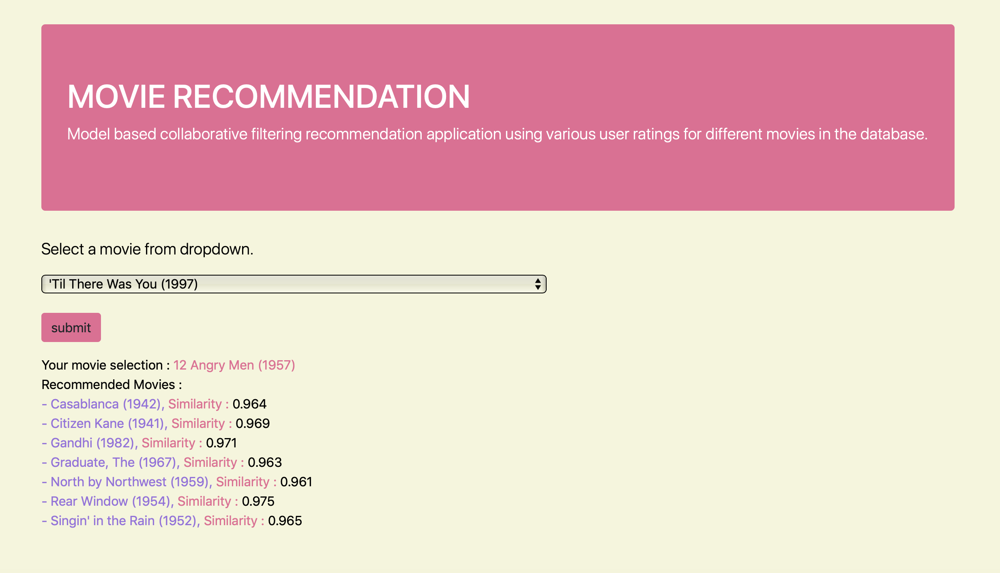

This Repository focuses on Recommendation systems, I majorily cover 3 types of recommendation system.

- Popularity based 
- Correlation based 
- Model Based collaborative Filtering ( User Ratings )

Although all the above 3 have been tried, the recommendation is app is based on Collaborative filtering which relies on user ratings and its correlation.

Recommendation Model (app):
- Uses Utility Matrix and decomposes the same using TruncatedSVD from Sklearn.
- Uses User ratings for various movies
- Recommends based on correlation between ratings for various movies.

Django Application Setup:
- `django-admin startproject mysite` this will create a new folder with mysite in the current 
directory. 
- `python manage.py runserver` to start the server
- `python manage.py startapp app` to create app
- add app to `settings`
- `include(app.urls)` to main urls.
- create view.py and functions to call the links in applications
- create urls.py for the applications.

# video

